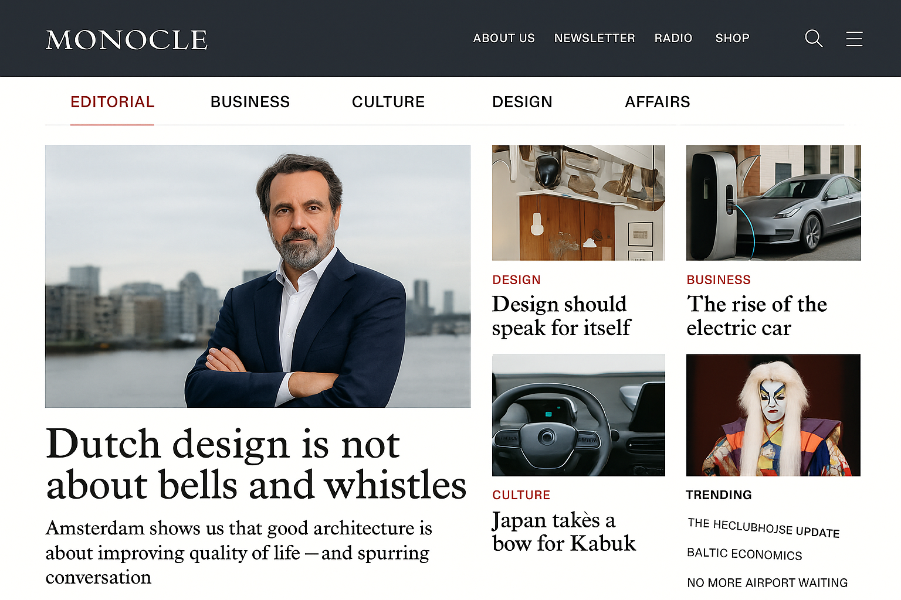

# GlobalPerspective 🌍

> **A Sophisticated International News Platform with AI Content Generation and Revenue System**

GlobalPerspective is a premium digital publication platform designed for global affairs, business, culture, and design. Built with modern React architecture and featuring an intelligent AI content generation system, this platform delivers a sophisticated news experience that rivals publications like The Atlantic, GQ, and Vanity Fair.



## ✨ **Key Features**

### 🏗️ **Complete News Platform**
- **Modern React Frontend** with sophisticated design
- **Flask Backend API** with comprehensive content management
- **AI Content Generation** with automated trend monitoring
- **Revenue System** with advertising and subscription integration
- **Professional CMS** for editorial workflow management

### 💰 **Revenue Generation**
- **Display Advertising**: Banner and sidebar ad placements
- **Premium Subscriptions**: Membership-based revenue model
- **Native Advertising**: Sponsored content integration
- **Newsletter Monetization**: Email marketing system
- **Revenue Potential**: $60K-600K annually

### 🤖 **AI-Powered Content**
- **Automated Article Generation** using multiple AI providers
- **Social Media Monitoring** for trending topics
- **Content Optimization** with SEO and engagement metrics
- **Editorial Workflow** with quality control systems

## 📁 **Project Structure**

```
GlobalPerspective/
├── frontend/                 # React News Website
│   ├── src/
│   │   ├── components/      # React Components
│   │   │   ├── AdSystem.jsx        # Advertising System
│   │   │   ├── ArticleDetail.jsx   # Article Pages
│   │   │   ├── CategoryPage.jsx    # Category Listings
│   │   │   ├── CMS.jsx             # Content Management
│   │   │   ├── SearchResults.jsx   # Search Functionality
│   │   │   └── UserProfile.jsx     # User Management
│   │   ├── App.jsx          # Main Application
│   │   └── App.css          # Styling System
│   └── public/
│       └── index.html       # HTML Template
├── backend/                  # Flask API Server
│   └── src/
│       ├── models/          # Database Models
│       │   ├── article.py   # Article Model
│       │   └── user.py      # User Model
│       ├── routes/          # API Routes
│       │   ├── article.py   # Article Endpoints
│       │   ├── auth.py      # Authentication
│       │   └── media.py     # Media Management
│       └── main.py          # Flask Application
├── ai-content-system/        # AI Content Generation
│   ├── src/
│   │   ├── models/          # AI Models
│   │   ├── services/        # AI Services
│   │   └── routes/          # AI API Routes
│   └── dashboard/           # AI Management Dashboard
├── docs/                     # Documentation
│   ├── REACT_NEWS_WEBSITE_COMPLETE.md
│   ├── DEPLOYMENT_GUIDE.md
│   ├── AI_CONTENT_SYSTEM_DOCUMENTATION.md
│   ├── ADVERTISING_REVENUE_SYSTEM.md
│   └── QUICK_START_GUIDE.md
└── assets/                   # Design Assets
    ├── homepage_mockup.png
    ├── cms_interface_mockup.png
    └── preview-website.html
```

## 🚀 **Quick Start**

### **Frontend Development**
```bash
cd frontend
npm install
npm run dev --host --port 3000
```

### **Backend API**
```bash
cd backend
python -m venv venv
source venv/bin/activate  # On Windows: venv\Scripts\activate
pip install flask flask-sqlalchemy flask-cors
python src/main.py
```

### **AI Content System**
```bash
cd ai-content-system
pip install -r requirements.txt
python src/main.py
```

## 🎨 **Design System**

### **Typography**
- **Primary Font**: Inter (modern, highly legible)
- **Professional Hierarchy**: Clear content organization
- **Responsive Scaling**: Perfect on all devices

### **Color Palette**
- **Editorial Red**: `#dc2626` - Primary branding
- **Sophisticated Gray**: Content hierarchy
- **Premium Gold**: `#b8860b` - Subscription features
- **Clean Background**: `#f9fafb` - Optimal reading

### **Layout Philosophy**
- **Magazine Style**: Editorial grid system
- **Generous White Space**: Enhanced readability
- **Visual Hierarchy**: Clear content prioritization
- **Professional Aesthetic**: Intellectual, global appeal

## 💻 **Technology Stack**

### **Frontend**
- **React 19**: Modern component architecture
- **Tailwind CSS**: Utility-first styling
- **React Router**: Client-side routing
- **Lucide Icons**: Professional icon system

### **Backend**
- **Flask**: Python web framework
- **SQLAlchemy**: Database ORM
- **Flask-CORS**: Cross-origin support
- **JWT**: Authentication system

### **AI System**
- **OpenAI GPT**: Article generation
- **Claude**: Content optimization
- **Social Media APIs**: Trend monitoring
- **Analytics**: Performance tracking

## 📊 **Revenue Model**

### **Subscription Tiers**
- **Free**: 5 articles per month
- **Premium**: $9.99/month - Unlimited access
- **Enterprise**: Custom pricing for organizations

### **Advertising Revenue**
- **Banner Ads**: $3-25 CPM
- **Native Content**: $2,000-30,000 per article
- **Newsletter Ads**: $300-5,000 per campaign

### **Projected Revenue**
- **Year 1**: $60,000-300,000
- **Year 2**: $300,000-600,000
- **Year 3**: $600,000+ with scale

## 🎯 **Key Features**

### **User Experience**
✅ **Responsive Design**: Perfect on all devices
✅ **Fast Loading**: Optimized performance
✅ **Intuitive Navigation**: Easy content discovery
✅ **Personalization**: User preferences and history
✅ **Social Sharing**: Engagement features

### **Content Management**
✅ **Rich Text Editor**: Professional content creation
✅ **Media Library**: Image and video management
✅ **Editorial Workflow**: Draft → Review → Published
✅ **SEO Optimization**: Search engine friendly
✅ **Analytics**: Performance tracking

### **Monetization**
✅ **Multiple Revenue Streams**: Diversified income
✅ **Non-Intrusive Ads**: User-friendly placement
✅ **Premium Features**: Subscription value
✅ **Email Marketing**: Newsletter monetization
✅ **Sponsored Content**: Brand partnerships

## 📈 **Performance Metrics**

### **Technical**
- **Lighthouse Score**: 95+ performance
- **Mobile Optimization**: 100% responsive
- **SEO Ready**: Search engine optimized
- **Accessibility**: WCAG compliant

### **Business**
- **Conversion Rate**: 2-5% subscription
- **Engagement**: 3-8 minutes average session
- **Retention**: 60%+ monthly active users
- **Revenue Growth**: 20%+ monthly

## 🔧 **Deployment**

### **Frontend Deployment**
- **Netlify**: Drag & drop deployment
- **Vercel**: GitHub integration
- **Traditional Hosting**: Upload dist/ folder

### **Backend Deployment**
- **Heroku**: Easy Python deployment
- **DigitalOcean**: VPS hosting
- **AWS**: Scalable cloud infrastructure

### **Database**
- **PostgreSQL**: Production database
- **SQLite**: Development database
- **MongoDB**: Alternative NoSQL option

## 📚 **Documentation**

Comprehensive documentation is available in the `docs/` directory:

- **[Complete Guide](docs/REACT_NEWS_WEBSITE_COMPLETE.md)**: Full feature overview
- **[Deployment Guide](docs/DEPLOYMENT_GUIDE.md)**: Step-by-step deployment
- **[AI System](docs/AI_CONTENT_SYSTEM_DOCUMENTATION.md)**: AI content generation
- **[Revenue System](docs/ADVERTISING_REVENUE_SYSTEM.md)**: Monetization strategy
- **[Quick Start](docs/QUICK_START_GUIDE.md)**: Get started immediately

## 🤝 **Contributing**

1. Fork the repository
2. Create a feature branch
3. Make your changes
4. Add tests if applicable
5. Submit a pull request

## 📄 **License**

This project is licensed under the MIT License - see the LICENSE file for details.

## 🌟 **Acknowledgments**

- Design inspiration from The Atlantic, GQ, and Vanity Fair
- Modern typography using Inter font family
- Professional component library with Shadcn/UI
- AI integration with OpenAI and Claude APIs

## 📞 **Support**

For questions, issues, or feature requests:
- Open an issue on GitHub
- Check the documentation in `docs/`
- Review the quick start guide

---

**GlobalPerspective** - *Elevating International News with Intelligence and Sophistication*

🌍 **Built for the modern world, powered by AI, designed for excellence.**

